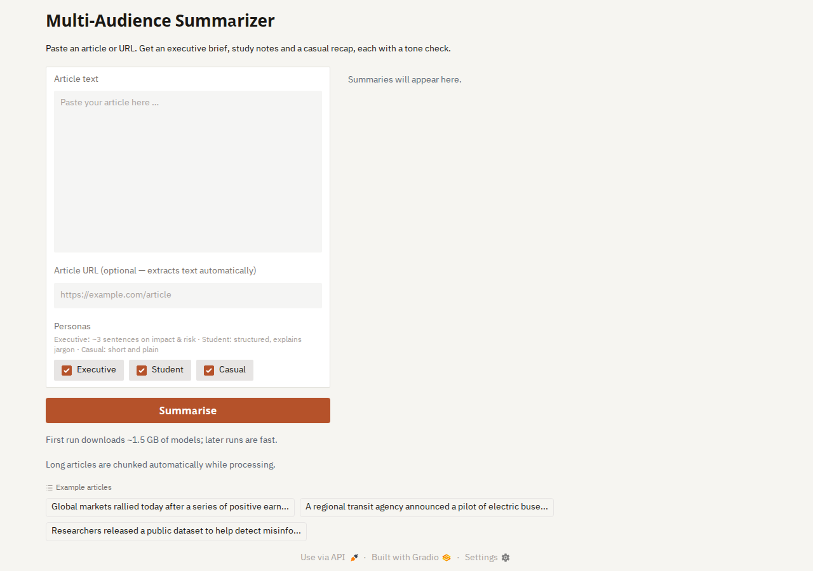

# Multi-Audience Summarizer

Summarise one article three ways (exec brief, study notes, casual recap) and see the tone of each.



Persona-aware article summarisation with a Gradio web UI, chunked long-input support, and CI via GitHub Actions.

---

## Running locally

### 1. Create and activate a virtual environment

```powershell
# Windows PowerShell
python -m venv .venv
.\.venv\Scripts\Activate.ps1
```

```bash
# macOS / Linux
python -m venv .venv
source .venv/bin/activate
```

### 2. Install dependencies

```bash
pip install -r requirements.txt
```

### 3. Run tests (fast, mocked, no model download)

```bash
pytest -q
```

### 4. Launch the Gradio UI

```powershell
# (PowerShell) If you have a corporate/system HTTP proxy, set NO_PROXY first:
$env:NO_PROXY = "localhost,127.0.0.1"

.\.venv\Scripts\python.exe app_gradio.py
# Open http://127.0.0.1:7860
```

```bash
# macOS / Linux
NO_PROXY="localhost,127.0.0.1" python app_gradio.py
# Open http://127.0.0.1:7860
```

### 5. Run the CLI backend directly

```bash
python app.py --save-outputs
# Outputs saved to samples/outputs/summary_outputs.jsonl
```

---

## First-run model downloads

The **first Summarise click** in the Gradio UI (or the first CLI run) will download approximately **~1.5 GB** of HuggingFace model data:

- Summarizer: `sshleifer/distilbart-cnn-12-6`
- Sentiment: `distilbert-base-uncased-finetuned-sst-2-english`

Set `HF_TOKEN` as an environment variable for authenticated / faster downloads:

```powershell
$env:HF_TOKEN = "hf_your_token_here"
```

Subsequent runs use the local HuggingFace cache and start instantly.

---

## Hugging Face Spaces (Gradio) deployment

To deploy on [Hugging Face Spaces](https://huggingface.co/spaces):

1. **Entrypoint**: Rename or alias `app_gradio.py` → `app.py`, or add a `Procfile`:
   ```
   web: python app_gradio.py
   ```

2. **Requirements**: Use the existing `requirements.txt`. Pin versions for reproducibility:
   ```
   transformers>=4.30
   torch>=2.0
   gradio>=4.0
   newspaper3k
   ```

3. **Environment variables** (set as HF Space secrets):
   - `HF_TOKEN` — for authenticated model downloads
   - `DEMO_MODEL` *(optional)* — override the default summarizer model name. Example: `sshleifer/distilbart-cnn-12-6` (default) or any compatible seq2seq model.

4. **Model download size**: ~1.5 GB on first build. HF Spaces caches models between restarts.

5. **CPU vs GPU**: The app runs on CPU by default. For faster inference on Spaces, select a GPU runtime (T4 small is sufficient).

---

## Using `DEMO_MODEL` to override the default summariser

Set the `DEMO_MODEL` environment variable **before** launching the app to swap
the summarisation model without editing code:

```powershell
# Windows PowerShell
$env:DEMO_MODEL = "philschmid/bart-large-cnn-samsum"   # smaller / faster
python app_gradio.py
```

```bash
# macOS / Linux
export DEMO_MODEL="philschmid/bart-large-cnn-samsum"
python app_gradio.py
```

> **Note:** `DEMO_MODEL` is documented for deployment flexibility. Wiring it into
> `app.py` is optional — the default model is `sshleifer/distilbart-cnn-12-6`.
>
> **To wire `DEMO_MODEL` into the codebase**, add
> `os.environ.get("DEMO_MODEL", "sshleifer/distilbart-cnn-12-6")` where
> `load_models()` is called in `app.py`. See [UI_HINTS.md](UI_HINTS.md) for
> additional snippets.

---

## Additional run guides

| Guide | Contents |
|-------|----------|
| [RUNNING_LOCALLY.md](RUNNING_LOCALLY.md) | Full local-run walkthrough (venv, proxy, troubleshooting) |
| [UI_HINTS.md](UI_HINTS.md) | Gradio wiring snippets for examples widget & word count |
| [docs/archive/QA_CHECKLIST.md](docs/archive/QA_CHECKLIST.md) | Cross-browser & accessibility testing checklist (archived) |
| [RELEASE.md](RELEASE.md) | Release packaging & tag instructions |

---

## Notes
- The first run will download Hugging Face models (internet required).
- Swap models in [app.py](app.py) if you want higher quality or speed.
- Tests are fully mocked — no GPU or model downloads needed for `pytest`.
- Long articles (>3 000 words) are automatically chunked and summarized in multiple passes.
- Historical process notes live under [docs/archive/](docs/archive/).

---

Built by [Odwa Manitshana, Software Developer & Automation Engineer](https://github.com/odwamanitshana)
